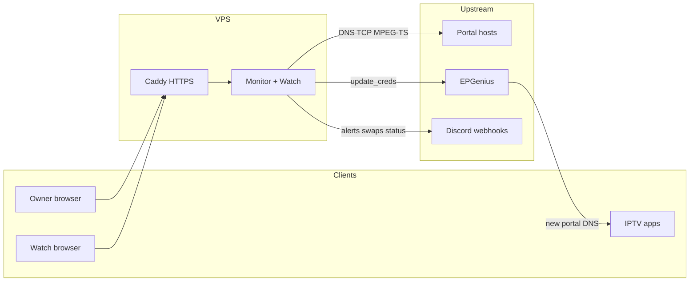
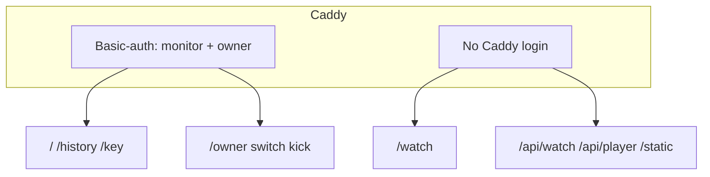
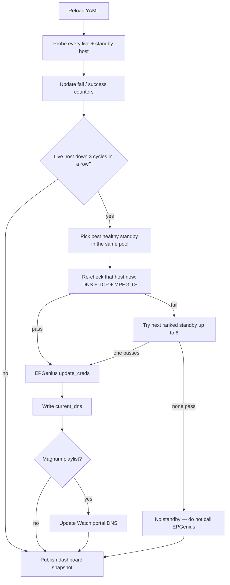
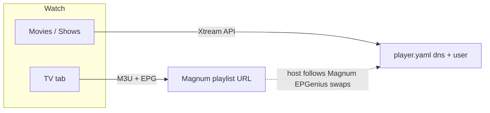

# IPTV portal monitor

One Python service that:

1. **Health-checks** Xtream portal hostnames (live DNS + a shared standby pool).
2. **Fails playlists over** through EPGenius when a live host stays down.
3. **Serves a status site** (public pool, owner playlists, 90-day history).
4. **Serves Watch** — a login-gated browser player on a dedicated account.

Run **one copy**. Two processes will fight over EPGenius and Discord.

Production is systemd behind Caddy on a VPS. Day-to-day ops: [deploy/README.md](deploy/README.md).

---

## How the pieces fit



Caddy terminates TLS and proxies to the app on `127.0.0.1:8787`. That port stays closed on the firewall. Watch and its media APIs are **not** behind Caddy basic-auth; they use the Watch site login. The monitor pages and owner APIs are.



A **read-only** Caddy user (optional) can open `/` and `/history` only — not Playlists, Info, Switch, or kick.

---

## Check cycle

Every `check_interval_seconds` (default 10s):



YAML (`settings`, `playlists`, `urls`) is re-read **every cycle**. Python or static file changes need a process restart.

The dashboard snapshot is published only when a cycle **finishes**. After a restart the panel can sit on “waiting…” with no cards for a minute or two while every host is probed.

---

## What “healthy” means

A host is healthy when this cycle’s probe returns **no** `fail_reason`. Checks run in order; the first failure wins. Nameserver lookup is informational only — it never fails a URL.

| Step | Default | Pass if |
|------|---------|---------|
| DNS | on (5s) | A/AAAA exists (or the host is already an IP) |
| TCP | on (5s) | Something accepts a connection on the portal port |
| HTTP `GET /` | **off** | Xtream homepages lie; leave this off |
| MPEG-TS | on (10s) | Xtream auth works **and** a short live-TS prefix looks like real MPEG-TS |

These panels do not serve multicast UDP. Players pull **HTTP MPEG-TS**. That is the `mpeg-ts` flag on the cards.

The stream probe (from the machine running the monitor):

1. `player_api.php` with a playlist account from the **same provider pool**.
2. Rejects 401/403, panel codes 452/453/456/464, Cloudflare challenge HTML, TOS-abuse interstitials.
3. Reads about three MPEG-TS packets from `/live/{user}/{pass}/{id}.ts` and hangs up.
4. Ignores placeholder `black.ts` redirects.

So “mpeg-ts ok” means: **this account authenticated on this hostname, and one live id returned a few packets within 10 seconds, from the VPS.** It is not a guarantee that every channel will play on every ISP. That is why swaps **re-probe the chosen host immediately before EPGenius**.

| `fail_reason` | Meaning |
|---------------|---------|
| `dns_nxdomain` / `dns_timeout` / `dns_no_records` | Name did not resolve in time |
| `tcp_timeout` / `tcp_refused` | Port closed or unreachable |
| `stream_no_api` | `player_api.php` returned 404 |
| `stream_blocked` | 401/403, Cloudflare challenge, or non-JSON HTML |
| `stream_452` | Panel 452/453/456/464 — blocked, geo, or DNS-locked |
| `stream_auth` | JSON came back but Xtream `auth` was not 1 |
| `stream_no_mpegts` | Logged in, but the live path was not MPEG-TS |
| `stream_timeout` / `stream_error` | Network timeout or request error |
| `stream_not_verified` | Pre-swap recheck: DNS/TCP passed but MPEG-TS did not |

---

## Provider pools

Standby URLs and playlists are tagged with a **pool**. Default is `strong8k`. Magnum hosts must set `pool: magnum`.

- Health checks use only credentials from playlists in that pool.
- Failover, Switch, and Choose URL only move a playlist onto a URL in the **same** pool.
- The two providers never share logins or swap targets.

---

## Failover

### Auto

When a **live** host is down:

- Failures **1 and 2**: wait. Discord “down” on the first healthy→down edge.
- Failure **3** (~30s at a 10s interval): pick a standby that is healthy **this cycle**, same pool, not the failed URL.

Pick order:

1. Not Frequent failure, then Frequent failure only if nothing else is up.
2. Inside that: origin (no Cloudflare) → Cloudflare nameservers only → Cloudflare orange-cloud proxy.
3. Prefer hosts with at least `min_consecutive_successes_for_swap` (default 2) consecutive passes.

Playlists with `failover: false` are never auto-swapped. Manual Switch still works.

### Pre-swap recheck

The cycle snapshot is a shortlist. Immediately before EPGenius:

- Probe that host again (DNS + TCP + MPEG-TS).
- **Auto** and **Switch**: if it fails, try the next ranked standby (up to 6). A failed recheck is logged and counts as a down.
- **Choose URL**: if your pick fails, abort — current DNS is left as-is.
- **Switch back**: same full recheck of the original host.

### After EPGenius succeeds

- Write `current_dns` in `playlists.yaml` on the machine that is running (the live copy).
- Magnum: also write Watch’s portal DNS in `player.yaml` and refresh the in-memory live list.
- Discord swap webhook fires (this channel includes panel usernames/passwords by design — keep it private).

---

## Cloudflare and Frequent failure

| Badge | Meaning | Effect on failover |
|-------|---------|-------------------|
| Cloudflare proxy | A/AAAA is in Cloudflare’s published proxy ranges (orange-cloud) | Last-choice standby |
| Cloudflare NS | NS is Cloudflare but the A record is origin (grey-cloud) | Second-choice standby |
| Frequent failure | At least 3 **separate** downs in 24 hours | Skipped while any other healthy option exists |

Cloudflare does **not** mark a host down. A proxied host can still pass MPEG-TS.

Frequent failure is **not** History. The 24-hour file is only for the badge and skip list. The History tab stores 90 days of separate outages (up→down), not how long an outage lasted.

---

## Web UI

| Path | Who | What |
|------|-----|------|
| `/` | Monitor login | Standby cards (`dns` / `tcp` / `mpeg-ts`), alerts, events. No live DNS, no playlists. |
| `/owner` | Owner login | The same, plus Current DNS, playlists, Switch / Choose URL / Switch back, Watch sessions + kick. |
| `/history` | Monitor login | 90-day outage counts. Public JSON omits currently-live hosts that are not in the standby pool. |
| `/key` | Owner login | Legend (UP / DOWN / Cloudflare / Frequent failure / Switch / Watch). |
| `/watch` | Watch site login | Browser player. Not a Caddy user. |

Owner JSON includes playlist **usernames** and current DNS. It does not include panel passwords.

---

## Watch

A Chromium player for friends, on a **dedicated** Xtream account (`config/player.yaml`, default 5 concurrent streams). Do not put failover playlist credentials in `player.yaml`.



- **TV**: Magnum M3U (and EPG from `url-tvg` or `live_epg`). Playback URLs stay on the server; the browser gets a proxy.
- **Movies / Shows**: Xtream lists from `player.yaml`.
- Site users live in `watch_users.yaml` as PBKDF2 hashes only. First login forces a password change.
- Owner can see who is online/playing and sign a user out on every device.

---

## Discord

Three optional webhooks in `.env`:

| Webhook | Channel | Behaviour |
|---------|---------|-----------|
| `DISCORD_WEBHOOK_ALERTS` | Down / up / no standby / EPGenius errors | New posts on transitions |
| `DISCORD_WEBHOOK_SWAPS` | DNS changes | Includes panel credentials — private channel only |
| `DISCORD_WEBHOOK_STATUS` | One status board | **Edits** a single message (no notify spam). Immediate on real changes; “checked … ago” at most every `discord_status_min_interval_seconds` (default 60). |

Do not put the status webhook in the swaps channel.

---

## Files

| Path | In git? | Notes |
|------|---------|--------|
| `.env` | **No** | EPGenius key, Discord webhooks. Copy from `.env.example`. |
| `config/playlists.yaml` | **No** | Accounts, `current_dns` (rewritten on swap). |
| `config/urls.yaml` | **No** | Standby pool. Magnum rows need `pool: magnum`. |
| `config/player.yaml` | **No** | Watch portal + optional live M3U. |
| `config/watch_users.yaml` | **No** | Watch site logins (hashes only). |
| `config/settings.yaml` | Yes | Intervals, checks, dashboard bind. Production must keep `dashboard_host: 127.0.0.1`. |
| `config/*.example.yaml` | Yes | Templates. |
| `state/` | **No** | 24h failure stamps, 90-day history, Watch cache. |
| `logs/monitor.log` | **No** | Rotating log. |
| `src/iptv_monitor/` | Yes | The app. |
| `deploy/` | Yes | systemd unit, Caddy **template** (replace hostname and hashes on the server). |

`current_dns` must be the portal URL **as EPGenius expects it** (usually `http://host`, no extra port unless the panel really uses one).

The copy of `playlists.yaml` on a laptop is often stale. The live DNS is whatever the running process last wrote.

---

## Setup

Python 3.11+. From the repo root:

```powershell
python -m venv .venv
.\.venv\Scripts\Activate.ps1
pip install -e .
copy .env.example .env
copy config\playlists.example.yaml config\playlists.yaml
copy config\urls.example.yaml config\urls.yaml
copy config\player.example.yaml config\player.yaml
copy config\watch_users.example.yaml config\watch_users.yaml
```

Fill in `.env` and the gitignored YAML files. Hash a Watch password with:

```powershell
.\.venv\Scripts\python.exe main.py watch-hash
```

Paste the hash into `watch_users.yaml`. On Windows, if `python` is a Store stub, use `.\.venv\Scripts\python.exe`.

---

## Commands

Dry-run commands do **not** call EPGenius or rewrite `current_dns`.

```powershell
.\.venv\Scripts\python.exe main.py check
.\.venv\Scripts\python.exe main.py test urls
.\.venv\Scripts\python.exe main.py test failover
.\.venv\Scripts\python.exe main.py test discord
.\.venv\Scripts\python.exe main.py test dashboard
.\.venv\Scripts\python.exe main.py test dashboard --demo-down
.\.venv\Scripts\python.exe main.py apply account-1
.\.venv\Scripts\python.exe main.py watch-hash
```

| Command | What it does |
|---------|----------------|
| `check` / `test urls` | One probe of live + standby. Table + this-cycle failover preview. |
| `test failover` | Same probes, then what **would** swap if the 3-failure threshold were already met. |
| `test discord` | `[TEST]` posts to alerts and swaps. Status webhook gets a one-off test board (does not replace the live message). |
| `test dashboard` | UI with live probes, no Discord, no swaps. |
| `test dashboard --demo-down` | Same, plus a fake down URL so the red banner is visible. |
| `apply <playlist>` | Push that playlist’s `current_dns` to EPGenius and send the swap alert. `--dns` / `--from-url` if needed. |
| `watch-hash` | Print a PBKDF2 hash for `watch_users.yaml`. |
| `python main.py` | **Live:** swaps and Discord are real. |
| `python main.py --no-dashboard` | Live checks without the web UI. |

`python main.py --once` is an alias for `check`.

---

## Keep it running

**VPS (live):** systemd unit `iptv-monitor`. Git push does **not** update the server — copy files, then restart for Python/static changes. YAML-only edits reload on the next cycle. See [deploy/README.md](deploy/README.md).

**Windows (lab only):** Task Scheduler job from `scripts/install-windows-task.ps1`. Do **not** enable this while the VPS unit is live.

Production `config/settings.yaml` must bind the dashboard to `127.0.0.1`. The git copy may use `0.0.0.0` for local LAN testing — do not copy that bind address onto the VPS wholesale.

---

## Code map

| Module | Role |
|--------|------|
| `config.py` | Settings, playlists, URLs, `.env`. Persist `current_dns` / Watch DNS after a swap. |
| `health.py` | Per-URL DNS → TCP → optional HTTP → MPEG-TS. |
| `stream.py` | Xtream `player_api.php` + short MPEG-TS read. |
| `nameserver.py` | NS lookup and Cloudflare proxy-range detection. |
| `monitor.py` | Cycle, counters, failover, pre-swap recheck, dashboard snapshot. |
| `history.py` | 90-day outage store (`state/url_history.json`). |
| `epgenius.py` | `update_creds` HTTP call. |
| `notify.py` | Discord webhooks + edited status board. |
| `dashboard.py` | FastAPI routes for monitor / owner / history. |
| `watch.py` / `player_*.py` | Watch login, catalogue, media proxy, presence, slots. |
| `player_sync.py` | Periodic M3U / Xtream / EPG refresh into `state/`. |
| `dryrun.py` | `check` / `test` commands. |
| `__main__.py` | CLI and logging. |
